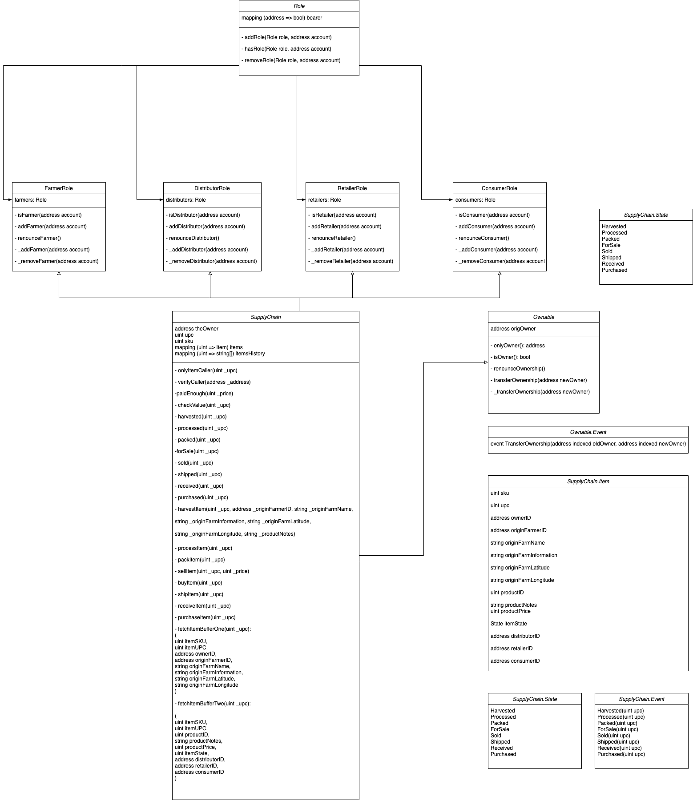

# Supply chain & data auditing

This repository containts an Ethereum DApp that demonstrates a Supply Chain flow between a Seller and Buyer. The user story is similar to any commonly used supply chain process. A Seller can add items to the inventory system stored in the blockchain. A Buyer can purchase such items from the inventory system. Additionally a Seller can mark an item as Shipped, and similarly a Buyer can mark an item as Received.

The DApp User Interface when running should look like...


## Getting Started

These instructions will get you a copy of the project up and running on your local machine for development and testing purposes. See deployment for notes on how to deploy the project on a live system.

### Prerequisites

Please make sure you've already installed ganache-cli, Truffle and enabled MetaMask extension in your browser.

```
Give examples (to be clarified)
```

### Installing

A step by step series of examples that tell you have to get a development env running

Clone this repository:

```
git clone https://github.com/udacity/nd1309/tree/master/course-5/project-6
```

Change directory to ```project-6``` folder and install all requisite npm packages (as listed in ```package.json```):

```
cd project-6
npm install
```

Launch Ganache:

```
ganache-cli -m "spirit supply whale amount human item harsh scare congress discover talent hamster"
```

Your terminal should look something like this:


In a separate terminal window, Compile smart contracts:

```
truffle compile
```

Your terminal should look something like this:


This will create the smart contract artifacts in folder ```build\contracts```.

Migrate smart contracts to the locally running blockchain, ganache-cli:

```
truffle migrate
```

Your terminal should look something like this:


Test smart contracts:

```
truffle test
```

All 10 tests should pass.


In a separate terminal window, launch the DApp:

```
npm run dev
```

## Built With

* [Ethereum](https://www.ethereum.org/) - Ethereum is a decentralized platform that runs smart contracts
* [Truffle Framework](http://truffleframework.com/) - Truffle is the most popular development framework for Ethereum with a mission to make your life a whole lot easier.


## Authors

See also the list of [contributors](https://github.com/smurfySpooferton/supply_chain/graphs/contributors) who participated in this project.

## Acknowledgments

* Solidity
* Ganache-cli
* Truffle

## Diagrams



## Contract migration including contract addresses
```
Starting migrations...

> Network name:    'rinkeby'
> Network id:      4
> Block gas limit: 29999972 (0x1c9c364)


1_initial_migration.js
======================

   Deploying 'Migrations'
   ----------------------
   > transaction hash:    0x4608b601c7bdfc53843312762e2a1d669092ae7b6bc3f0033b2999a6485e9bde
   > Blocks: 0            Seconds: 8
   > contract address:    0x7c139AB18Ebe6226fc686572c4ecbA6249C17FBB
   > block number:        8979811
   > block timestamp:     1626935513
   > account:             0x18d02c8b037cC04AeB166CA177FA921BB5a520a1
   > balance:             18.823534591
   > gas used:            239894 (0x3a916)
   > gas price:           10 gwei
   > value sent:          0 ETH
   > total cost:          0.00239894 ETH


   > Saving migration to chain.
   > Saving artifacts
   -------------------------------------
   > Total cost:          0.00239894 ETH


2_deploy_contracts.js
=====================

   Deploying 'FarmerRole'
   ----------------------
   > transaction hash:    0xe0ad8fd21c97ddc51af729566f7ba7409d438206d7501ff78013cdbf3ee3fc7c
   > Blocks: 0            Seconds: 8
   > contract address:    0xE25dd18FFF435A164fbc9c7f83c54fD66334CCde
   > block number:        8979813
   > block timestamp:     1626935543
   > account:             0x18d02c8b037cC04AeB166CA177FA921BB5a520a1
   > balance:             18.819711561
   > gas used:            336555 (0x522ab)
   > gas price:           10 gwei
   > value sent:          0 ETH
   > total cost:          0.00336555 ETH


   Deploying 'DistributorRole'
   ---------------------------
   > transaction hash:    0xd259c73f506d2e2e5b4ce938123ebd82402df13ae5ac0ae4d1cb7a23b9bef1b5
   > Blocks: 1            Seconds: 12
   > contract address:    0x4e6Da8A9F075FacDe38b9eE470192E288E7Cf20a
   > block number:        8979814
   > block timestamp:     1626935558
   > account:             0x18d02c8b037cC04AeB166CA177FA921BB5a520a1
   > balance:             18.816345411
   > gas used:            336615 (0x522e7)
   > gas price:           10 gwei
   > value sent:          0 ETH
   > total cost:          0.00336615 ETH


   Deploying 'RetailerRole'
   ------------------------
   > transaction hash:    0xd4223c9758d6b9361d3966522567e77cbe88bd3b18cac304dab4b5081b3b2da3
   > Blocks: 0            Seconds: 8
   > contract address:    0x06Fd7060149c45f98470ABd3857313B17ed82E3b
   > block number:        8979815
   > block timestamp:     1626935573
   > account:             0x18d02c8b037cC04AeB166CA177FA921BB5a520a1
   > balance:             18.812979381
   > gas used:            336603 (0x522db)
   > gas price:           10 gwei
   > value sent:          0 ETH
   > total cost:          0.00336603 ETH


   Deploying 'ConsumerRole'
   ------------------------
   > transaction hash:    0x0cd9e36cded962305ee7de637348cd832b0f4b2346e7bf090c8be71e5062a47d
   > Blocks: 0            Seconds: 8
   > contract address:    0x5da9618B18216294493cb034E693C55F564161F1
   > block number:        8979816
   > block timestamp:     1626935588
   > account:             0x18d02c8b037cC04AeB166CA177FA921BB5a520a1
   > balance:             18.809613591
   > gas used:            336579 (0x522c3)
   > gas price:           10 gwei
   > value sent:          0 ETH
   > total cost:          0.00336579 ETH


   Deploying 'SupplyChain'
   -----------------------
   > transaction hash:    0x3aa993e04a65ebdeb5b238341e70567c5b8cff7184d2f397bb3c275b62849904
   > Blocks: 1            Seconds: 12
   > contract address:    0xC8Ab1DbffAeaEe7e23e9190Ee4ddD455fb41316A
   > block number:        8979817
   > block timestamp:     1626935603
   > account:             0x18d02c8b037cC04AeB166CA177FA921BB5a520a1
   > balance:             18.781971331
   > gas used:            2764226 (0x2a2dc2)
   > gas price:           10 gwei
   > value sent:          0 ETH
   > total cost:          0.02764226 ETH


   > Saving migration to chain.
   > Saving artifacts
   -------------------------------------
   > Total cost:          0.04110578 ETH


Summary
=======
> Total deployments:   6
> Final cost:          0.04350472 ETH
```